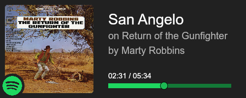

# spotify-status
API which gets your current playing status on spotify and compiles it into a pretty image!

# Example
<br>


# Usage

# Hosting your own version
1. Clone the repository and install the dependencies
```bash
git clone https://github.com/OneAndonlyFinbar/spotify-status.git
cd spotify-status
```
2. Create a new application on the [Spotify Developer Dashboard](https://developer.spotify.com/dashboard/applications)
3. Add `http://localhost:3000/callback` as a redirect URI
4. Fill required fields in the `.env.example` file and rename it to `.env`
5. Execute SQL script in `database.sql`
6. Compile and run the application
```bash
tsc
cd dist
node index
```