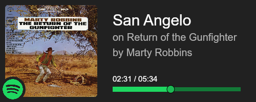

# spotify-status
API which gets your current playing status on spotify and compiles it into a pretty image!

# Example
 

# Usage
~Notice: Awaiting verification from spotify, url will not work.~ 
Spotify has an abhorrently restrictive developer policy that has pushed me to not host a public version of this project.

~1. Link account https://spotify-status.finbar.xyz/
2. After linking go to https://spotify-status.finbar.xyz/current/USER_ID to get a given users playing status~

# Hosting your own version
~Better instructions comming soon~

I'm sure you can figure it out
